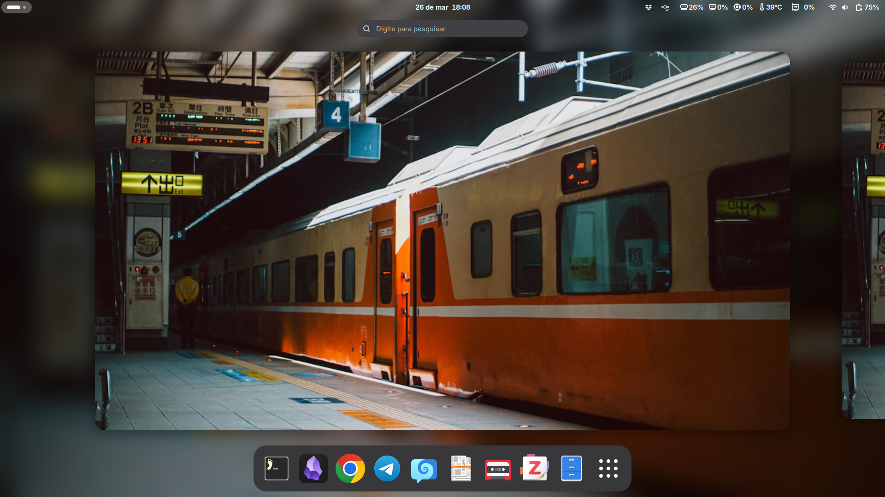
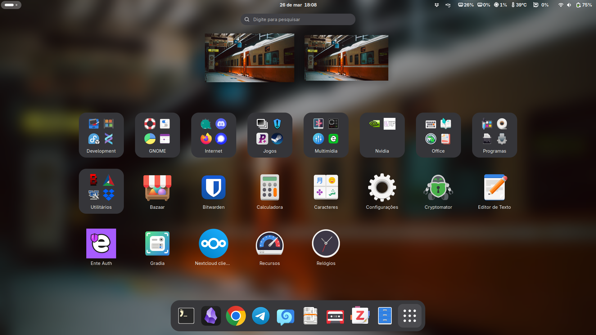

#  archpost-installation

 

Eu uso os scripts desse repositório **somente após** instalar o Arch Linux
usando o script de instalação
[archinstall](https://github.com/archlinux/archinstall) fornecido pela
[ISO](https://archlinux.org/download/) oficial.

**Último teste dos scripts: 19 de junho de 2024** / Os scripts foram alterados
após essa data.

Os scripts foram concebidos **especificamente** para a configuração da minha
máquina. Notebook Lenovo LOQ 15IRH8, Intel Core i5-12450H, 16GB de RAM, 2 X
512GB SSD M.2, NVIDIA GeForce RTX 3050 6GB GDDR6, teclado Logitech K120, mouse
Logitech M90, joystick Multilaser Js091 e headset HyperX Cloud Stinger.

Eu instalo o sistema em UEFI, com systemd-boot, sistema de arquivos EXT4, ZRAM,
kernel stable e kernel lts (seleciono ambos durante a instalação via
archinstall), pipewire, wireplumber, repositório multilib habilitado (ativado
por intermédio do archinstall), Nvidia GPU com o driver Nvidia open kernel
module (versão dkms), shell Zsh com Oh My Zsh, Rio terminal, AUR helper Yay,
Flatpak, Podman, Distrobox, Apparmor, firewalld, libvirt, Incus, asdf,
intel_pstate scaling driver, thermald e x86_energy_perf_policy para
gerenciamento de frequências da CPU e do perfil de energia (uso o notebook
ligado na tomada), ananicy-cpp, equalização paramétrica para o Headset HyperX
Cloud Stinger, Helix Editor e GNOME (Wayland). As configurações dos scripts são
concebidas nessa base.

Os scripts deverão ser executados após a inicialização do sistema no ambiente
gráfico.

Caso o git não esteja instalado no sistema, execute:

`sudo pacman -S git --needed`

Para usar os scripts clone o repositório e acesse a pasta:

`git clone http://github.com/henriqueffc/archpost-installation`

`cd archpost-installation`

É necessário dar permissão de execução para os arquivos .sh

`chmod +x *.sh`

Ordem de uso dos scripts:

- 1-initialconfig.sh (esse script deve ser executado com o comando sudo -
  `sudo ./initialconfig.sh`)
- 2-video-e-audio.sh
- 3-pacotes.sh
- 4-flatpak.sh
- 5-yay.sh
- 6-grid.sh
- 7-zsh-ohmyzsh.sh
- 8-podman-distrobox-incus.sh
- 9-helix.sh
- 10-firefox-nightly.sh (opcional)

Recomendo reinicializar o sistema após a execução de cada script.

Concluída a etapa de execução dos scripts verifique o arquivo
[config-finais.md](https://github.com/henriqueffc/archpost-installation/blob/main/config-finais.md)
para encerrar a configuração do sistema.

Histórico dos resultados de desempenho do processador usando o Arch Linux -
[Geekbench](https://browser.geekbench.com/user/430599)

#### Screenshots

