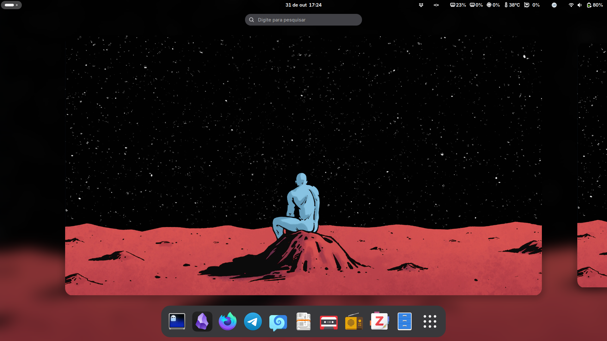
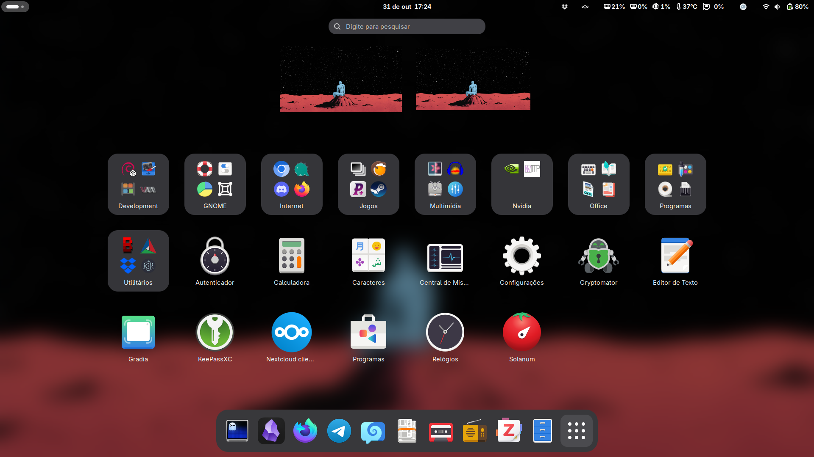

#  archpost-installation

  

Eu uso os scripts desse repositório **somente após** instalar o Arch Linux usando o script de instalação [archinstall](https://github.com/archlinux/archinstall) fornecido pela [ISO](https://archlinux.org/download/) oficial.

**Último teste dos scripts: 11 de março de 2023** / Os scripts foram alterados após essa data.

Os scripts foram concebidos **especificamente** para a configuração da minha máquina. Notebook Lenovo S145, Intel Core i7-8565U, 20GB de RAM, SSD 240GB, SSD 512GB M.2 NVMe, NVIDIA GeForce MX110, teclado Logitech K120, mouse Logitech M90, joystick Multilaser Js091 e headset HyperX Cloud Stinger.

Eu instalo o sistema em UEFI, com systemd-boot, sistema de arquivos EXT4, ZRAM, pipewire, wireplumber, repositório multilib habilitado (ativado por intermédio do archinstall), Nvidia com driver proprietário (versão dkms), shell Zsh com Oh My Zsh, Tmux, terminal Alacritty, AUR helper Yay, Flatpak, Podman, Distrobox, Apparmor, firewalld, libvirt, Vagrant, intel_pstate scaling driver, cpupower e x86_energy_perf_policy para gerenciamento de frequências da CPU e do perfil de energia (uso o notebook ligado na tomada), firmware para o áudio da Sound Open Firmware, equalização paramétrica para o Headset HyperX Cloud Stinger, Astronvim e GNOME (Wayland). As configurações dos scripts são concebidas nessa base.

Os scripts deverão ser executados após a inicialização do sistema no ambiente gráfico.

Caso o git não esteja instalado no sistema, execute:

`sudo pacman -S git --needed`

Para usar os scripts clone o repositório e acesse a pasta:

`git clone http://github.com/henriqueffc/archpost-installation`

`cd archpost-installation`

É necessário dar permissão de execução para os arquivos .sh

`chmod +x *.sh`

Ordem de uso dos scripts:

- 1-initialconfig.sh (esse script deve ser executado com o comando sudo - `sudo ./initialconfig.sh`)
- 2-video-e-audio.sh
- 3-pacotes.sh
- 4-flatpak-e-mc.sh
- 5-yay.sh
- 6-grid.sh
- 7-extensions.sh
- 8-zsh-ohmyzsh.sh
- 9-podman-distrobox.sh
- 10-astronvim.sh
- 11-theme.sh (opcional)
- 12-firefox-nightly.sh (opcional)
- 13-espanso-wayland.sh (opcional)

Recomendo reinicializar o sistema após a execução de cada script.

Concluída a etapa de execução dos scripts verifique o arquivo [config-finais.md](https://github.com/henriqueffc/archpost-installation/blob/main/config-finais.md) para encerrar a configuração do sistema.

Histórico dos resultados de desempenho do processador usando o Arch Linux - [Geekbench](https://browser.geekbench.com/user/430599)

#### Screenshots

