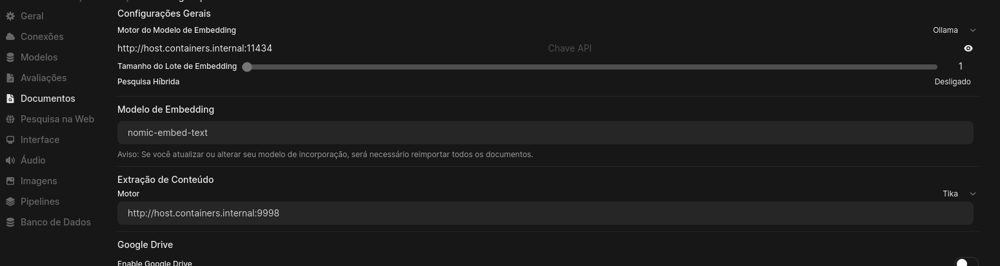

# Configurações necessárias após as execuções dos scripts

[1 - Tema e extensões](https://github.com/henriqueffc/archpost-installation/blob/main/config-finais.md#1---tema-e-extens%C3%B5es)
|
[2 - SSH](https://github.com/henriqueffc/archpost-installation/blob/main/config-finais.md#2---ssh)
|
[3 - NVMe](https://github.com/henriqueffc/archpost-installation/blob/main/config-finais.md#3---nvme)
|
[4 - Nautilus](https://github.com/henriqueffc/archpost-installation/blob/main/config-finais.md#4---nautilus)
|
[5 - Fstab](https://github.com/henriqueffc/archpost-installation/blob/main/config-finais.md#5---fstab)
|
[6 - Ext4](https://github.com/henriqueffc/archpost-installation/blob/main/config-finais.md#6---ext4)
|
[7 - Xpad](https://github.com/henriqueffc/archpost-installation/blob/main/config-finais.md#7---xpad)
|
[8 - Rclone](https://github.com/henriqueffc/archpost-installation/blob/main/config-finais.md#8---rclone)
|
[9 - Conservation mode - Lenovo Loq 15IRH8](https://github.com/henriqueffc/archpost-installation/blob/main/config-finais.md#9---conservation-mode---lenovo-loq-15irh8)
|
[10 - Steam](https://github.com/henriqueffc/archpost-installation/blob/main/config-finais.md#10---steam)
|
[11 - Heroic Games Launcher](https://github.com/henriqueffc/archpost-installation/blob/main/config-finais.md#11---heroic-games-launcher)
|
[12 - Fallback](https://github.com/henriqueffc/archpost-installation/blob/main/config-finais.md#12---fallback)
|
[13 - Bluetooth](https://github.com/henriqueffc/archpost-installation/blob/main/config-finais.md#13---bluetooth)
|
[14 - Geoclue](https://github.com/henriqueffc/archpost-installation/blob/main/config-finais.md#14---geoclue)
|
[15 - Aplicativos](https://github.com/henriqueffc/archpost-installation/blob/main/config-finais.md#15---aplicativos)
|
[16 - Piper](https://github.com/henriqueffc/archpost-installation/blob/main/config-finais.md#16---piper)
|
[17 - Newsflash](https://github.com/henriqueffc/archpost-installation/blob/main/config-finais.md#17---newsflash)
|
[18 - Ordem do boot](https://github.com/henriqueffc/archpost-installation/blob/main/config-finais.md#18---ordem-do-boot)
|
[19 - Upscayl](https://github.com/henriqueffc/archpost-installation/blob/main/config-finais.md#19---upscayl)
|
[20 - Zotero](https://github.com/henriqueffc/archpost-installation/blob/main/config-finais.md#20---zotero)
|
[21 - Open WebUI](https://github.com/henriqueffc/archpost-installation/blob/main/config-finais.md#21---open-webui)
|
[22 -Incus](https://github.com/henriqueffc/archpost-installation/blob/main/config-finais.md#22---incus)

### 1 - Tema e extensões

**Tema**

Configure o tema dos programas que usam QT através dos aplicativos _Qt5
Settings_ e _Qt6 Settings_

Escolha o estilo breeze, paleta personalizada darker e tema de ícones breeze
dark. Na aba Fonts selecione a fonte Adwaita Sans (Regular - tamanho 11).

Nos programas que usam QT e permitem configurar a aparência (keepassxc, etc.)
escolha o tema breeze dark ou escuro.

**Extensões**

Uso as extensões System Monitor, Blur my Shell, Wallpaper Slideshow e
AppIndicator/KStatusNotifierItem habilitadas. Para acessar as configurações das
extensões use o
[Gerenciador de extensões](https://flathub.org/pt-BR/apps/com.mattjakeman.ExtensionManager)
(instalado com o script n.° 4). A extensão AppIndicator/KStatusNotifierItem foi
intalada com o pacote
[gnome-shell-extension-appindicator](https://archlinux.org/packages/extra/any/gnome-shell-extension-appindicator/)
(instalada com o script n.° 2 e habilitada com o script n.° 3). O restante das
extensões foram instaladas e habilitadas no script n.° 3. Na extensão Wallpaper
Slideshow é preciso configurar a pasta que contém as imagens para o wallpaper.

### 2 - SSH

Configurar o Fail2ban - porta SSH e o SSH.

### 3 - NVMe

Não altere a identificação do ponto de montagem. Mude as flags (coloque
`defaults,noatime,x-gvfs-show,commit=60,barrier=0`) e o tipo de sistema de
arquivos (auto -> ext4) da partição do NVMe no aplicativo Discos. Lembrando que
essa configuração é para a partição do NVMe em que ficam instalados os jogos,
VMs e outros dados. Não é configuração a ser aplicada para a partição do
sistema, do boot ou a home.

### 4 - Nautilus

Atalhos no Nautilus (File). A fonte que contém os símbolos foi instalada pelo
script número 3.

`echo "file:///mnt/ponto_de_montagem 🖴  NVME" >> ~/.config/gtk-3.0/bookmarks`

`echo "file:///home/$USER/Dropbox 📤 Dropbox" >> ~/.config/gtk-3.0/bookmarks`

`mkdir ~/Documentos/Projetos && echo "file:///home/$USER/Documentos/Projetos 🎒 Projetos" >>~/.config/gtk-3.0/bookmarks`

### 5 - Fstab

Acrescente nos parâmetros das partições **ext4** e montadas pelo sistema no boot
as seguintes especificações `commit=60` e `barrier=0`.

`sudo nano /etc/fstab`

### 6 - Ext4

Habilite o
[fast commit](https://wiki.archlinux.org/title/Ext4#Enabling_fast_commit_in_existing_filesystems)
para todas as partições Ext4 do sistema.

`sudo tune2fs -O fast_commit /dev/caminho_da_partição`

Habilite a checagem do filesystem pelo tune2fs/e2fsck no boot para todas as
partições Ext4 do sistema (no comando abaixo a verificação está definida para
ser efetuada depois de 20 montagens da partição)

`sudo tune2fs -c 20 /dev/caminho_da_partição`

Para verificar se a configuração foi habilitada, execute:

`sudo dumpe2fs -h /dev/caminho_da_partição`

```
Maximum mount count:      20
```

Faça as configurações no fstab disponíveis no link
<https://wiki.archlinux.org/title/Fsck#fstab_options> para as partições do
sistema que são montadas no boot e que não sejam a partição root (Ext4) e a
partição boot. Lembrando que as partições devem ser Ext4. Sem essa configuração
(0 2) essas partições não serão verificadas pelo tune2fs na inicialização.

Verifique se as partições Ext4 estão em 64-bit, com o
[metadata checksums](https://wiki.archlinux.org/title/Ext4#Enabling_metadata_checksums_in_existing_filesystems),
o metadata_csum_seed e o orphan_file habilitados.

`sudo dumpe2fs -h /dev/caminho_da_partição | grep features`

Exemplo com as flags habilitadas:

```
Filesystem features: has_journal ext_attr resize_inode dir_index fast_commit orphan_file 
filetype needs_recovery extent 64bit flex_bg metadata_csum_seed sparse_super large_file 
huge_file dir_nlink extra_isize metadata_csum orphan_present
```

Caso alguma das flags mencionadas acima não estejam na saída do comando, faça o
seguinte:

Verifique se o [módulo](https://wiki.archlinux.org/title/Kernel_module)
`crc32c_intel` está ativo (o i5-12450H possui a flag SSE 4.2 e pode operar com
esse módulo):

`lsmod | grep crc32c`

Se o módulo não estiver habilitado inclua-o nos
[módulos do mkinitcpio](https://wiki.archlinux.org/title/Mkinitcpio#MODULES).

A partição objeto do procedimento não pode estar montada para a execução dos
comandos abaixo.

`sudo e2fsck -Df /dev/caminho_da_partição` (otimização da partição -
obrigatório)

`sudo resize2fs -b /dev/caminho_da_partição` (conversão para 64-bit - somente se
o 64bit não estiver disponível na lista)

`sudo tune2fs -O metadata_csum /dev/caminho_da_partição` (habilitando o metadata
checksums - execute somente se o metadata_csum não estiver disponível na lista)

`sudo tune2fs -O metadata_csum_seed /dev/caminho_da_partição` (execute somente
se o metadata_csum_seed não estiver disponível na lista)

`sudo tune2fs -O orphan_file /dev/caminho_da_partição` (execute somente se o
orphan_file não estiver disponível na lista)

Verifique a lista novamente usando
`sudo dumpe2fs -h /dev/camimho_da_partição | grep features`

### 7 - Xpad

O controle Multilaser JS091 (Shanwan Controler) está funcionando corretamente
como Microsoft Corp. Xbox360 Controller (verifique com `lsusb`). Caso não
funcione instale a atualização para o Xpad disponível no site
<https://github.com/paroj/xpad> ou utilize o pacote disponível no AUR
`game-devices-udev` <https://codeberg.org/fabiscafe/game-devices-udev>

### 8 - Rclone

Configurar o remote no rclone e fazer o scprit de sincronização.

### 9 - Conservation mode - Lenovo Loq 15IRH8

Modo de conservação da bateria. Se for habilitado manterá a carga máxima da
bateria em 80%. Verifique se o módulo do kernel ideapad_laptop está carregado
com o comando `lsmod | grep ideapad`. Se não estiver os comandos indicados a
seguir não irão funcionar. Apure o valor presente no sistema com o seguinte
comando:

`cat /sys/bus/platform/drivers/ideapad_acpi/VPC2004:00/conservation_mode`

Pode acontecer da pasta VPC2004:00 ter outra nomenclatura. Averigue no sistema.

Se o módulo estiver carregado no sistema e a pasta VPC2004:00 for a correta
execute como root os comandos abaixo:

Para Habilitar

`echo 1 > /sys/bus/platform/drivers/ideapad_acpi/VPC2004:00/conservation_mode`

Para desabilitar

`echo 0 > /sys/bus/platform/drivers/ideapad_acpi/VPC2004:00/conservation_mode`

### 10 - Steam

Opções de inicialização para os jogos na Steam usando a placa dedicada Nvidia.

**OpenGL + Nvidia**

`__GL_MaxFramesAllowed=1 mangohud --dlsym prime-run %command%`

É possível utilizar o parâmetro `__GL_THREADED_OPTIMIZATIONS=1`, mas é preciso
efetuar testes. Tem jogos que não funcionam com ele.

O parâmetro `__GL_SYNC_TO_VBLANK=0` pode ajudar em jogos que estejam muito
lentos, mas o uso da GPU sobe consideravelmente.

Caso o jogo não inicie use a variável `SDL_VIDEODRIVER=X11`. Se ela não
funcionar, substitua por `SDL_DYNAMIC_API=/usr/lib64/libSDL2-2.0.so`

Se o jogo apresentar o erro
`gameoverlayrenderer.so' from LD_PRELOAD cannot be preloaded` (execute a Steam
pelo terminal para verificar), use os parâmetros
`LD_PRELOAD="libpthread.so.0 libGL.so.1" __GL_MaxFramesAllowed=1 mangohud --dlsym prime-run %command%`.
Caso ele não funcione faça um teste usando os parâmetros
`LD_PRELOAD=~/.local/share/Steam/ubuntu12_64/gameoverlayrenderer.so __GL_MaxFramesAllowed=1 mangohud --dlsym prime-run %command%`
Esse erro não costuma impedir a abertura do jogo ou interferir na jogabilidade.

O prime-run no Arch Linux faz o mesmo que
`__NV_PRIME_RENDER_OFFLOAD=1 __VK_LAYER_NV_optimus=NVIDIA_only __GLX_VENDOR_LIBRARY_NAME=nvidia`

Se porventura o Mangohud não inicializar, use o parâmetro
`LD_PRELOAD=/usr/lib/mangohud/libMangoHud.so:/usr/lib32/mangohud/libMangoHud.so`

**SOM**

Na eventualidade de o som não funcionar, tente executar os jogos com o parâmetro
`SDL_AUDIODRIVER=alsa`

**DXVK - Vulkan - Nvidia**

`VK_DRIVER_FILES=/usr/share/vulkan/icd.d/nvidia_icd.json STAGING_WRITECOPY=1 STAGING_SHARED_MEMORY=1 mangohud prime-run %command%`

O parâmetro `VKD3D_CONFIG=dxr11,dxr` habilita o raytracing.

**Gamemode**

Não uso o gamemode. O funcionamento do gamemode conflita com o ananicy-cpp.

**FPS**

Uso o Mangohud para controlar o fps. Faço a configuração desse recurso pelo
Goverlay.

**Shaders**

Aumente a quantidade de cores para pré-compilar os shaders.

`echo "unShaderBackgroundProcessingThreads 10" >> ~/.steam/steam/steam_dev.cfg`

Habilite o download prévio dos sombreadores nas configurações da Steam
(Configurações - Download - Sombreadores).

**Problemas com a transmissão ao vivo na Steam**

Execute no terminal (com a Steam fechada)

`steam-runtime steam://unlockh264/` ou `steam steam://unlockh264/`

### 11 - Heroic Games Launcher

Nas configurações do jogo, na opção "outros", habilite o MangoHud e o uso da
placa dedicada.

**Vulkan**

Na opção "avançado", configure as variáveis de ambiente para o Vulkan. Ex.: nome
da variável `VK_DRIVER_FILES` - Valor `/usr/share/vulkan/icd.d/nvidia_icd.json`
Veja os restantes das variáveis no item Steam / DXVK - Vulkan - Nvidia.

**OpenGL**

Para jogos OpenGL use a seguinte variável: nome da variável
`__GL_MaxFramesAllowed` valor `1`. Veja mais variáveis no item Steam / OpenGL +
Nvidia.

### 12 - Fallback

Caso a imagem para o kernel fallback esteja sendo gerada pelo mkinitcpio, faça o
seguinte:

`sudo nano /etc/mkinitcpio.d/linux.preset`

Mude a linha `PRESETS=('default' 'fallback')` para

`PRESETS=('default')`

Se o sistema possui outros kernels instalados, eles estarão na mesma pasta. Ex.:
o kernel lts estará com o preset `linux-lts.preset`

É preciso deletar as entradas para o loader do systemd-boot e as imagens do
fallback. Os arquivos possuem fallback no nome. Fique atento a esse detalhe.

`sudo rm /boot/loader/entries/linux-fallback.conf`

`sudo rm /boot/initramfs-linux-fallback.img`

Regenere o initramfs:

`sudo mkinitcpio -P`

### 13 - Bluetooth

Caso o bluetooth não esteja funcionando, execute
`sudo rfkill unblock bluetooth && sudo systemctl restart bluetooth`. Os pacotes
necessários para o funcionamento do bluetooth já foram instalados no sistema e
as configurações para os recursos experimentais do bluetooth foram executadas no
script número n.° 3.

### 14 - Geoclue

**Geoclue estático**

Se preferir usar o geoclue estático, faça as configurações abaixo.

No arquivo de configuração abaixo deixe `enable=true` somente na opção
`[static-source]`

`sudo nano /etc/geoclue/geoclue.conf`

Construa o arquivo para o Geoclue estático

`sudo nano /etc/geolocation`

Exemplo de conteúdo para o arquivo `gelocation`. Verifique a latitude e a
longitude usando o Google Maps. Coloque 1.0 na altura e 20.00 no radius. Remova
os comentários.

```
# Example static location file for a machine inside Statue of Liberty torch
40.6893129   # latitude
-74.0445531  # longitude
96           # altitude
1.83         # accuracy radius (the diameter of the torch is 12 feet)
```

Execute: `sudo chown geoclue /etc/geolocation` e
`sudo chmod 600 /etc/geolocation`

Reinicie o serviço `sudo systemctl restart geoclue.service`

Verifique o status do serviço `sudo systemctl status geoclue.service`

Verifique o funcionamento do Geoclue estático com o comando
`/usr/lib/geoclue-2.0/demos/where-am-i` e no programa GNOME Maps.

**Desabilitar o serviço**

Se quiser desabilitar o Geoclue use os seguintes comandos:

`gsettings set org.gnome.system.location enabled false` ou

`sudo systemctl mask geoclue.service`

Manual do [Geoclue](https://man.archlinux.org/man/extra/geoclue/geoclue.5.en)

### 15 - Aplicativos

**Falhas na renderização**

Se algum aplicativo GTK não funcionar adequadamente, utilize a variável
`GSK_RENDERER=ngl`. Caso o app seja um flatpak suas configurações podem ser
alteradas no app Flatseal, mudando a variável em Environment. No script número
n.° 4 foi configurada a variável de ambiente `GSK_RENDERER=ngl` para os apps
flatpaks. Alguns aplicativos que foram atualizados para Application Platform
version 47 não estão inicializando sem essa variável. Confira as variáveis do
sistema para flatpaks com o comando `cat /var/lib/flatpak/overrides/global` Para
retirar essas variáveis apague a entrada no arquivo
`/var/lib/flatpak/overrides/global`. As variáveis configuradas por aplicativo
flatpak estão localizadas em `~/.local/share/flatpak/overrides`

**Início no startup**

Habilite a inicialização do Dropbox junto com o sistema. Use o app Ajustes e
faça a configuração em Aplicativos de inicialização.

**Segundo plano**

Desabilite o funcionamento dos aplicativos Gajim, Apostrophe e Discord em
segundo plano. Pode ser feito pelo Flatseal ou pelas configurações do Gnome
(Aplicativos).

### 16 - Piper

Se optar por alterar a vozes usadas no speech-dispatcher para as
disponibilizadas pelo projeto [Piper](https://github.com/rhasspy/piper), faça os
procedimentos abaixo.

Efetue o [download](https://github.com/rhasspy/piper/releases) do último binário
(piper_linux_x86_64.tar.gz) para sistemas Linux disponibilizado no site do
projeto no Github.

Descompacte o arquivo `tar -xf piper_linux_x86_64.tar.gz` no seu diretório
$HOME. Crie o diretório voices no diretório descompactado.
`mkdir -p ~/piper/voices`

Crie o arquivo urls.txt e insira o seguinte conteúdo:

```
https://huggingface.co/rhasspy/piper-voices/resolve/v1.0.0/pt/pt_BR/faber/medium/pt_BR-faber-medium.onnx.json
https://huggingface.co/rhasspy/piper-voices/resolve/v1.0.0/pt/pt_BR/faber/medium/pt_BR-faber-medium.onnx
https://huggingface.co/rhasspy/piper-voices/resolve/v1.0.0/en/en_US/ryan/medium/en_US-ryan-medium.onnx.json
https://huggingface.co/rhasspy/piper-voices/resolve/v1.0.0/en/en_US/ryan/medium/en_US-ryan-medium.onnx
```

O site [huggingface.co](https://huggingface.co/rhasspy/piper-voices/tree/main)
disponibiliza outras vozes.

Para download utilize o comando
`wget --directory-prefix ~/piper/voices --input-file urls.txt`

Configure o módulo piper no speech-dispatcher.

`mkdir -p ~/.config/speech-dispatcher/modules`

`nano ~/.config/speech-dispatcher/modules/piper.conf`

Insira o conteúdo abaixo.

```
GenericExecuteSynth "if command -v sox > /dev/null; then\
        PROCESS=\'sox -r 22050 -c 1 -b 16 -e signed-integer -t raw - -t wav - tempo $RATE pitch $PITCH norm\'; OUTPUT=\'$PLAY_COMMAND\';\
    elif command -v paplay > /dev/null; then\
        PROCESS=\'cat\'; OUTPUT=\'$PLAY_COMMAND --raw --channels 1 --rate 22050\';\
    else\
        PROCESS=\'cat\'; OUTPUT=\'aplay -t raw -c 1 -r 22050 -f S16_LE\';\
    fi;\
    echo \'$DATA\' | ~/piper/piper --model ~/piper/voices/pt_BR-faber-medium.onnx --output_raw | $PROCESS | $OUTPUT;"
GenericRateAdd 2
GenericPitchAdd 1
GenericVolumeAdd 1
GenericRateMultiply 1
GenericPitchMultiply 1000
AddVoice "pt-BR" "male1" "pt_BF-faber-medium"
AddVoice "en-US" "male1" "en_US-ryan-medium"
```

Crie o arquivo speechd.conf

`nano ~/.config/speech-dispatcher/speechd.conf`

Insira o conteúdo abaixo.

```
## Fonte: /etc/speech-dispatcher/speechd.conf
##
AddModule "piper" "sd_generic" "piper.conf"
DefaultVoiceType  "male1"
#DefaultLanguage   pt-BR
DefaultModule   piper
LogLevel  3
LogDir  "default"
DefaultVolume 100
SymbolsPreproc "char"
SymbolsPreprocFile "gender-neutral.dic"
SymbolsPreprocFile "font-variants.dic"
SymbolsPreprocFile "symbols.dic"
SymbolsPreprocFile "emojis.dic"
SymbolsPreprocFile "orca.dic"
SymbolsPreprocFile "orca-chars.dic"
Include "clients/*.conf"
```

As configurações anteriores ajustam o speech-dispatcher para o idioma pt-BR.
Para alterar para o inglês ou voltar para o pt-BR, use os seguintes alias:

```
alias piper-pt="sed -i 's/en_US-ryan-medium.onnx/pt_BR-faber-medium.onnx/g' ~/.config/speech-dispatcher/modules/piper.conf"
alias piper-en="sed -i 's/pt_BR-faber-medium.onnx/en_US-ryan-medium.onnx/g' ~/.config/speech-dispatcher/modules/piper.conf"
```

Para testar o funcionamento use o comando spd-say ou habilite o Screen Reader
nas configurações de acessibilidade do GNOME.

```
spd-say "oi como você está?"
spd-say "You’re playing a dangerous game Carl"
```

### 17 - Newsflash

Caso a versão em flatpak do app Newsflash não tenha conexão com a rede, faça o
seguinte:

`nano ~/.var/app/io.gitlab.news_flash.NewsFlash/config/news-flash/newsflash_gtk.json`

Substitua a linha `"ping_url": "http://exemple.com/"` por
`"ping_url": "http://192.168.0.1/"`. O endereço 192.168.0.1 é o gateway.
Verifique qual é o gateway da sua rede.

### 18 - Ordem do boot

Verifique o ID do kernel com o comando `bootctl list`. Selecione o kernel que
você deseja para a inicialização do sistema com o comando
`sudo bootctl set-default ID_do_kernel` Faça o update do
[systemd-boot](https://wiki.archlinux.org/title/Systemd-boot) com o comando
`sudo bootctl update`. Para alterar o tempo de exibição ou esconder a tela de
apresentação das opções de inicialização do sistema edite o arquivo
`loader.conf` em `/boot/loader/loader.conf`. Na opção `timeout` defina o tempo
desejado (em segundos) da exibição ou coloque 0 para esconder as opções de
inicialização. Para acessar a tela, caso opte por escondê-la, após ligar o
notebook pressione a barra de espaço do teclado.

### 19 - Upscayl

Caso queira utilizar a versão em Appimage efetue o download na página do
[github](https://github.com/upscayl/upscayl). A versão em flatpak foi instalada
pelo script número n.° 4. Se o app não funcionar com a placa dedicada out of the
box, use o app flatpak Gear Lever para configurar o appimage. Após selecionar
para colocar o app no grid, coloque como variáveis de ambiente (última opção da
tela) o seguinte: Key = `VK_DRIVER_FILES` Value =
`/usr/share/vulkan/icd.d/nvidia_icd.json` e Key =
`__EGL_VENDOR_LIBRARY_FILENAMES` Value =
`/usr/share/glvnd/egl_vendor.d/10_nvidia.json` Isso fará com que o aplicativo
funcione com a placa dedicada.

### 20 - Zotero

Faça o download do arquivo xpi das seguintes extensões:

- [better notes](https://github.com/windingwind/zotero-better-notes)
- [OCR](https://github.com/UB-Mannheim/zotero-ocr)

Para a extensão OCR funcionar é necessária a instalação dos pacotes poppler,
poppler-data, tesseract, tesseract-data-eng e tesseract-data-por. Esses pacotes
foram instalados pelo script n.º 3. Nas configurações da extensão no Zotero
configure a localização para o tesseract `/usr/bin/tesseract` e para o pdftoppm
`/usr/bin/pdftoppm`.

### 21 - Open WebUI

Uso o Open WebUI com o Ollama instalado no sistema. Como uso o Ollama em outros
programas, preferi fazer esse modo de instalação, sem usar o Open WebUI com o
Ollama instalado no container. Os pacotes nvidia-container-toolkit e ollama-cuda
foram instalados pelos scripts números 2 e 3.

Para usar o Open WebUI junto com o Ollama do sistema é preciso acrescentar em
`/usr/lib/systemd/system/ollama.service`

```
Environment="OLLAMA_HOST=0.0.0.0:11434"
```

Faça o reload do systemd

`sudo systemctl daemon-reload`

Reinicie o ollama.service

`sudo systemctl restart ollama.service`

Crie a pasta para o uso do Podman Quadlet

`mkdir -p ~/.config/containers/systemd/`

Acesse a pasta criada e insira os conteúdos abaixo nos seguintes arquivos.

`nano openwebui.container`

```
[Unit]
Description=Open-Webui app container
After=tika.service
After=podman-user-wait-network-online.service

[Container]
Image=ghcr.io/open-webui/open-webui:cuda
ContainerName=open-webui
AutoUpdate=registry
PublishPort=3000:8080
AddHost=host.containers.internal:host-gateway
AddDevice=nvidia.com/gpu=all
Network=podman
Volume=open-webui:/app/backend/data

[Service]
Restart=always

[Install]
WantedBy=multi-user.target default.target
```

`nano tika.container`

```
[Unit]
Description=Tika container
After=podman-user-wait-network-online.service

[Container]
Image=docker.io/apache/tika:latest-full
ContainerName=tika
AutoUpdate=registry
PublishPort=9998:9998
Network=podman

[Service]
Restart=always

[Install]
WantedBy=multi-user.target default.target
```

Faça o reload do systemd (usuário)

`systemctl --user daemon-reload`

Inicie os containers

`systemctl --user start tika.service`

`systemctl --user start openwebui.service`

Instale o seguinte modelo de embedding

`ollama pull nomic-embed-text`

Nas configurações do Open WebUI (Painel do Admin - Configurações - Conexões /
Documentos) mude a URL da API do Ollama, o motor do modelo de embedding
(Ollama), a URL do modelo de embedding, o nome do modelo de embedding
(nomic-embed-text), o motor para a extração de conteúdo (Tika) e a URL para a
extração de conteúdo.

URL da API do Ollama e do modelo de embedding

`http://host.containers.internal:11434`

URL do motor para a extração de conteúdo

`http://host.containers.internal:9998`




Endereço para acessar o Open WebUI

`http://localhost:3000/`

É possível instalar e atualizar os modelos usando a interface web do Open WebUI
ou diretamente pelo terminal usando o Ollama.

Para atualizar a imagem dos containers, execute `podman auto-update`. Para
excluir as imagens não utilizadas, execute `podman image prune -a`

### 22 - Incus

Execute os seguintes comandos para configurar o Incus.

Configuração do profile

`incus admn init`

O Arch Linux não distribui firmware ovmf com secure boot assinado. Para iniciar
máquinas virtuais, você precisa desativar o secure boot. Inclua a configuração
no profile padrão.
[Arch Wiki - Incus](https://wiki.archlinux.org/title/Incus#Starting_a_virtual_machine_fails)

`incus profile set default security.secureboot=false`

Com o uso do firewalld, é necessário desabilitar as regras de firewall incluídas
no Incus e adicionar as regras para o Incus no firewalld.
[Incus Firewall](https://linuxcontainers.org/incus/docs/main/howto/network_bridge_firewalld/)

O nome da interface da rede `incusbr0` é a escolhida por padrão nas
configurações do profile. Caso altere o nome, substitua nos comandos abaixo.

`incus network set incusbr0 ipv4.firewall false`

`sudo firewall-cmd --zone=trusted --change-interface=incusbr0 --permanent`

`sudo firewall-cmd --reload`
